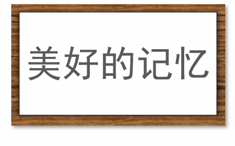
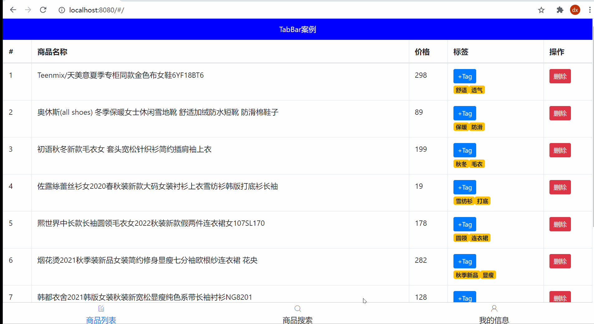
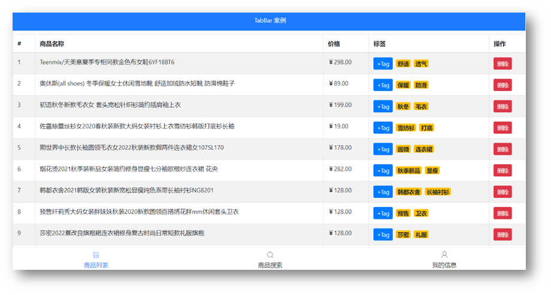
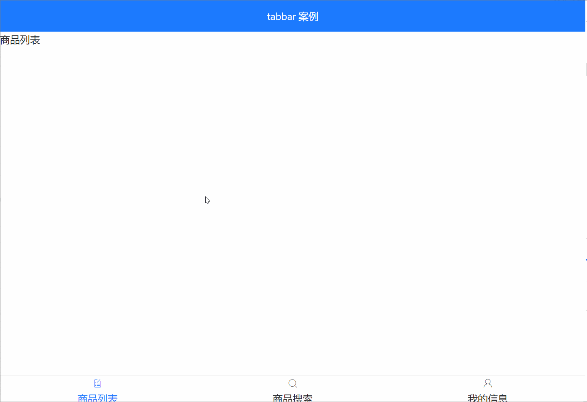
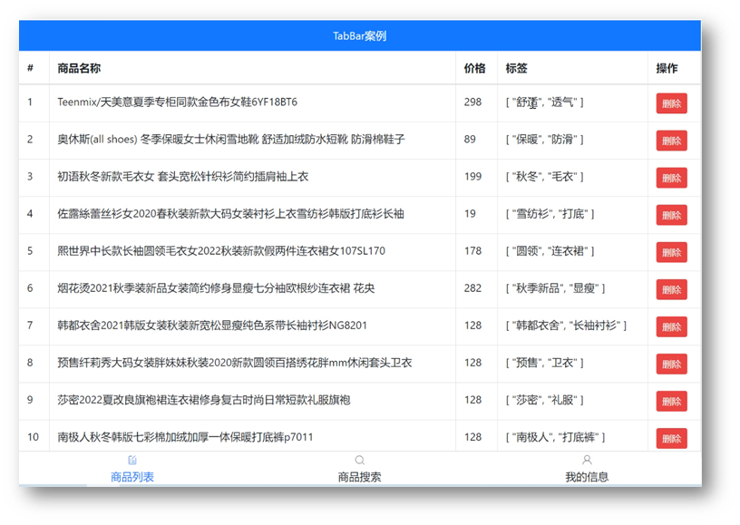
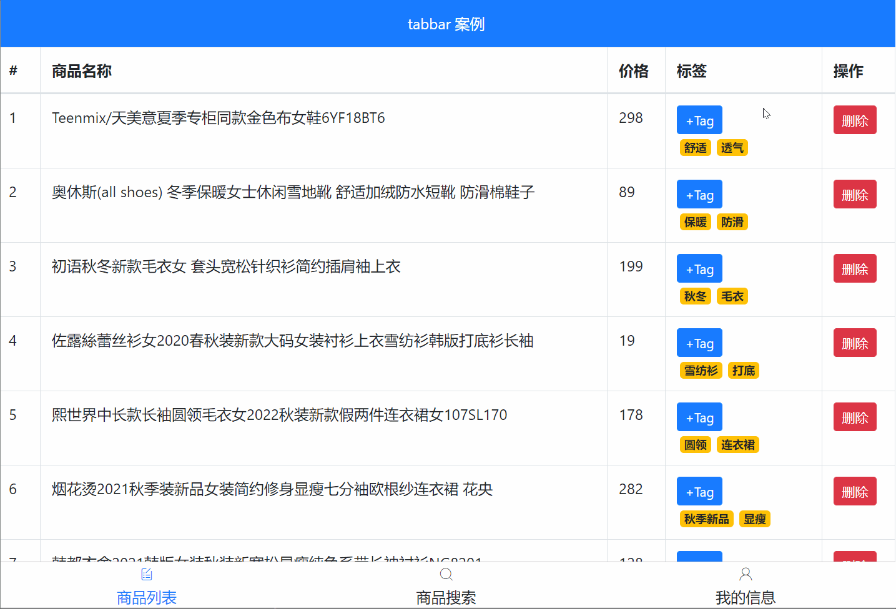

# Day06

## 知识点自测

- [ ] ==组件创建, 注册和使用 - 伸手就来特别熟练==
- [ ] 指令的作用

## 今日学习目标

1. 能够了解组件进阶知识
2. 能够掌握自定义指令创建和使用
3. 能够完成tabbar案例的开发

## 1. 组件进阶

### 1.0 组件进阶 - 动态组件

> 目标: 多个组件使用同一个挂载点，并动态切换，这就是动态组件

需求: 完成一个注册功能页面, 2个按钮切换, 一个填写注册信息, 一个填写用户简介信息

效果如下:


1. 准备被切换的 - UserName.vue / UserInfo.vue 2个组件

2. 引入到UseDynamic.vue注册

3. 准备变量来承载要显示的"组件名"

4. 设置挂载点<component>, 使用is属性来设置要显示哪个组件

5. 点击按钮 – 修改comName变量里的"组件名"

```vue
<template>
  <div>
      <button @click="comName = 'UserName'">账号密码填写</button>
      <button @click="comName = 'UserInfo'">个人信息填写</button>

      <p>下面显示注册组件-动态切换:</p>
      <div style="border: 1px solid red;">
          <component :is="comName"></component>
      </div>
  </div>
</template>

<script>
// 目标: 动态组件 - 切换组件显示
// 场景: 同一个挂载点要切换 不同组件 显示
// 1. 创建要被切换的组件 - 标签+样式
// 2. 引入到要展示的vue文件内, 注册
// 3. 变量-承载要显示的组件名
// 4. 设置挂载点<component :is="变量"></component>
// 5. 点击按钮-切换comName的值为要显示的组件名

import UserName from '../components/01/UserName'
import UserInfo from '../components/01/UserInfo'
export default {
    data(){
        return {
            comName: "UserName"
        }
    },
    components: {
        UserName,
        UserInfo
    }
}
</script>
```

在App.vue - 引入01_UseDynamic.vue并使用显示

> 总结: vue内置component组件, 配合is属性, 设置要显示的组件名字

### 1.1 组件进阶 - 组件缓存

> 目标: 组件切换会导致组件被频繁销毁和重新创建, 性能不高

使用Vue内置的keep-alive组件, 可以让包裹的组件保存在内存中不被销毁

演示1: 可以先给UserName.vue和UserInfo.vue 注册created和destroyed生命周期事件, 观察创建和销毁过程

演示2: 使用keep-alive内置的vue组件, 让动态组件缓存而不是销毁

语法:

​		Vue内置的keep-alive组件 包起来要频繁切换的组件

02_UseDynamic.vue

```vue
<div style="border: 1px solid red;">
    <!-- Vue内置keep-alive组件, 把包起来的组件缓存起来 -->
    <keep-alive>
        <component :is="comName"></component>
    </keep-alive>
</div>
```

补充生命周期:

* activated - 激活
* deactivated - 失去激活状态

> 总结: keep-alive可以提高组件的性能, 内部包裹的标签不会被销毁和重新创建, 触发激活和非激活的生命周期方法

### 1.2 组件进阶 - 激活和非激活

> 目标: 被缓存的组件不再创建和销毁, 而是激活和非激活

补充2个钩子方法名:

​	activated – 激活时触发

​	deactivated – 失去激活状态触发

### ♥1.3 组件进阶 - 组件插槽

> 目标: 用于实现组件的内容分发, 通过 slot 标签, 可以接收到写在组件标签内的内容

vue提供组件插槽能力, 允许开发者在封装组件时，把不确定的部分定义为插槽

插槽例子:



需求: 以前折叠面板案例, 想要实现不同内容显示, 我们把折叠面板里的Pannel组件, 添加组件插槽方式


语法口诀: 

1. 组件内用<slot></slot>占位
2. 使用组件时<Pannel></Pannel>夹着的地方, 传入标签替换slot

03/Pannel.vue - 组件(直接复制)

```vue
<template>
  <div>
    <!-- 按钮标题 -->
    <div class="title">
      <h4>芙蓉楼送辛渐</h4>
      <span class="btn" @click="isShow = !isShow">
        {{ isShow ? "收起" : "展开" }}
      </span>
    </div>
    <!-- 下拉内容 -->
    <div class="container" v-show="isShow">
          <p>寒雨连江夜入吴,</p>
          <p>平明送客楚山孤。</p>
          <p>洛阳亲友如相问，</p>
          <p>一片冰心在玉壶。</p>
    </div>
  </div>
</template>

<script>
export default {
  data() {
    return {
      isShow: false,
    };
  },
};
</script>

<style scoped>
h3 {
  text-align: center;
}

.title {
  display: flex;
  justify-content: space-between;
  align-items: center;
  border: 1px solid #ccc;
  padding: 0 1em;
}

.title h4 {
  line-height: 2;
  margin: 0;
}

.container {
  border: 1px solid #ccc;
  padding: 0 1em;
}

.btn {
  /* 鼠标改成手的形状 */
  cursor: pointer;
}

img {
  width: 50%;
}
</style>
```

views/03_UserSlot.vue - 使用组件(==直接复制==)

框: 在这个基础重复使用组件

```vue
<template>
  <div id="container">
    <div id="app">
      <h3>案例：折叠面板</h3>
    </div>
  </div>
</template>

<script>
export default {
};
</script>

<style>
#app {
  width: 400px;
  margin: 20px auto;
  background-color: #fff;
  border: 4px solid blueviolet;
  border-radius: 1em;
  box-shadow: 3px 3px 3px rgba(0, 0, 0, 0.5);
  padding: 1em 2em 2em;
}
</style>
```

views/03_UseSlot.vue - 组件插槽使用

```vue
<template>
  <div id="container">
    <div id="app">
      <h3>案例：折叠面板</h3>
      <Pannel>
          
          <span>我是内容</span>
      </Pannel>
      <Pannel>
          <p>寒雨连江夜入吴,</p>
          <p>平明送客楚山孤。</p>
          <p>洛阳亲友如相问，</p>
          <p>一片冰心在玉壶。</p>
      </Pannel>
      <Pannel></Pannel>
    </div>
  </div>
</template>

<script>
import Pannel from "../components/03/Pannel";
export default {
  components: {
    Pannel,
  },
};
</script>
```

> 总结: 组件内容分发技术, slot占位, 使用组件时传入替换slot位置的标签

### ♥1.4 组件进阶 - 插槽默认内容

> 目标: 如果外面不给传, 想给个默认显示内容

口诀: <slot>夹着内容默认显示内容, 如果不给插槽slot传东西, 则使用<slot>夹着的内容在原地显示

```vue
<slot>默认内容</slot>
```

### ♥1.5 组件进阶 - 具名插槽

> 目标: 当一个组件内有2处以上需要外部传入标签的地方

传入的标签可以分别派发给不同的slot位置

要求: v-slot一般用跟template标签使用 (template是html5新出标签内容模板元素, 不会渲染到页面上, 一般被vue解析内部标签)

components/04/Pannel.vue - 留下具名slot

```vue
<template>
  <div>
    <!-- 按钮标题 -->
    <div class="title">
      <slot name="title"></slot>
      <span class="btn" @click="isShow = !isShow">
        {{ isShow ? "收起" : "展开" }}
      </span>
    </div>
    <!-- 下拉内容 -->
    <div class="container" v-show="isShow">
     <slot name="content"></slot>
    </div>
  </div>
</template>
```

views/04_UseSlot.vue使用

```vue
<template>
  <div id="container">
    <div id="app">
      <h3>案例：折叠面板</h3>
      <Pannel>
        <template v-slot:title>
          <h4>芙蓉楼送辛渐</h4>
        </template>
        <template v-slot:content>
          
          <span>我是内容</span>
        </template>
      </Pannel>
      <Pannel>
        <template #title>
          <span style="color: red;">我是标题</span>
        </template>
        <template #content>
          <p>寒雨连江夜入吴,</p>
          <p>平明送客楚山孤。</p>
          <p>洛阳亲友如相问，</p>
          <p>一片冰心在玉壶。</p>
        </template>
      </Pannel>
    </div>
  </div>
</template>

<script>
import Pannel from "../components/04/Pannel";
export default {
  components: {
    Pannel,
  },
};
</script>
```

==v-slot可以简化成#使用==

> v-bind可以省略成:    v-on: 可以省略成@   那么v-slot: 可以简化成#

> 总结: slot的name属性起插槽名, 使用组件时, template配合#插槽名传入具体标签

### ♥1.6 组件进阶 - 作用域插槽

> 目标: 子组件里值, 在给插槽赋值时在父组件环境下使用

复习: 插槽内slot中显示默认内容

例子: 默认内容在子组件中, 但是父亲在给插槽传值, 想要改变插槽显示的默认内容

口诀: 

1. 子组件, 在slot上绑定属性和子组件内的值
2. 使用组件, 传入自定义标签, 用template和v-slot="自定义变量名" 
3. scope变量名自动绑定slot上所有属性和值

components/05/Pannel.vue - 定义组件, 和具名插槽, 给slot绑定属性和值 

```vue
<template>
  <div>
    <!-- 按钮标题 -->
    <div class="title">
      <h4>芙蓉楼送辛渐</h4>
      <span class="btn" @click="isShow = !isShow">
        {{ isShow ? "收起" : "展开" }}
      </span>
    </div>
    <!-- 下拉内容 -->
    <div class="container" v-show="isShow">
     <slot :row="defaultObj">{{ defaultObj.defaultOne }}</slot>
    </div>
  </div>
</template>

<script>
// 目标: 作用域插槽
// 场景: 使用插槽, 使用组件内的变量
// 1. slot标签, 自定义属性和内变量关联
// 2. 使用组件, template配合v-slot="变量名"
// 变量名会收集slot身上属性和值形成对象
export default {
  data() {
    return {
      isShow: false,
      defaultObj: {
        defaultOne: "无名氏",
        defaultTwo: "小传同学"
      }
    };
  },
};
</script>
```

views/05_UseSlot.vue

```vue
<template>
  <div id="container">
    <div id="app">
      <h3>案例：折叠面板</h3>
      <Pannel>
        <!-- 需求: 插槽时, 使用组件内变量 -->
        <!-- scope变量: {row: defaultObj} -->
        <template v-slot="scope">
          <p>{{ scope.row.defaultTwo }}</p>
        </template>
      </Pannel>
    </div>
  </div>
</template>

<script>
import Pannel from "../components/05/Pannel";
export default {
  components: {
    Pannel,
  },
};
</script>
```

> 总结: 组件内变量绑定在slot上, 然后使用组件v-slot="变量"  变量上就会绑定slot身上属性和值

### ♥1.7 组件进阶 - 作用域插槽使用场景

> 目标: 了解作用域插槽使用场景, 自定义组件内标签+**内容**

案例: 封装一个表格组件, 在表格组件内循环产生单元格

准备MyTable.vue组件 – 内置表格, 传入数组循环铺设页面, 把对象每个内容显示在单元格里

准备UseTable.vue – 准备数据传入给MyTable.vue使用

components/06/MyTable.vue - 模板(==直接复制==)

```vue
<template>
  <div>
      <table border="1">
          <thead>
              <tr>
                  <th>序号</th>
                  <th>姓名</th>
                  <th>年龄</th>
                  <th>头像</th>
              </tr>
          </thead>
          <thead>
              <tr>
                  <td></td>
                  <td></td>
                  <td></td>
                  <td></td>
              </tr>
          </thead>
      </table>
  </div>
</template>

<script>
export default {

}
</script>
```

views/06_UseTable.vue - 准备数据, 传入给MyTable.vue组件里循环使用

```js
list: [
    {
        name: "小传同学",
        age: 18,
        headImgUrl:
        "http://yun.itheima.com/Upload/./Images/20210303/603f2d2153241.jpg",
    },
    {
        name: "小黑同学",
        age: 25,
        headImgUrl:
        "http://yun.itheima.com/Upload/./Images/20210304/6040b101a18ef.jpg",
    },
    {
        name: "智慧同学",
        age: 21,
        headImgUrl:
        "http://yun.itheima.com/Upload/./Images/20210302/603e0142e535f.jpg",
    },
],
```

例子: 我想要给td内显示图片, 需要传入自定义的img标签


正确做法:	

​	在MyTable.vue的td中准备<slot>占位, 但是外面需要把图片地址赋予给src属性,所以在slot上把obj数据绑定


components/06/MyTable.vue   - ==正确代码==

```vue
<template>
  <div>
      <table border="1">
          <thead>
              <tr>
                  <th>序号</th>
                  <th>姓名</th>
                  <th>年龄</th>
                  <th>头像</th>
              </tr>
          </thead>
          <tbody>
              <tr v-for="(obj, index) in arr" :key="index">
                  <td>{{ index + 1 }}</td>
                  <td>{{ obj.name }}</td>
                  <td>{{ obj.age }}</td>
                  <td>
                      <slot :row="obj">
                          <!-- 默认值给上,如果使用组件不自定义标签显示默认文字 -->
                          {{ obj.headImgUrl}}
                      </slot>
                  </td>
              </tr>
          </tbody>
      </table>
  </div>
</template>

<script>
export default {
    props: {
        arr: Array
    }
}
</script>
```

​	在UseTable使用MyTable的时候, template上v-slot绑定变量, 传入img组件设置图片地址

```vue
<template>
  <div>
    <MyTable :arr="list"></MyTable>
    <MyTable :arr="list">
        <!-- scope: {row: obj} -->
       <template v-slot="scope">
            <a :href="scope.row.headImgUrl">{{ scope.row.headImgUrl }}</a>
       </template>
    </MyTable>
    <MyTable :arr="list">
       <template v-slot="scope">
            
       </template>
    </MyTable>
  </div>
</template>

<script>
import MyTable from "../components/06/MyTable";
export default {
  components: {
    MyTable,
  },
  data() {
    return {
      list: [
        {
          name: "小传同学",
          age: 18,
          headImgUrl:
            "http://yun.itheima.com/Upload/./Images/20210303/603f2d2153241.jpg",
        },
        {
          name: "小黑同学",
          age: 25,
          headImgUrl:
            "http://yun.itheima.com/Upload/./Images/20210304/6040b101a18ef.jpg",
        },
        {
          name: "智慧同学",
          age: 21,
          headImgUrl:
            "http://yun.itheima.com/Upload/./Images/20210302/603e0142e535f.jpg",
        },
      ],
    };
  },
};
</script>

<style>
</style>
```

> 总结: 插槽可以自定义标签, 作用域插槽可以把组件内的值取出来自定义内容

## 2. 自定义指令

[自定义指令文档](https://www.vue3js.cn/docs/zh/guide/custom-directive.html)

除了核心功能默认内置的指令 (`v-model` 和 `v-show`)，Vue 也允许注册自定义指令。 `v-xxx`  

html+css的复用的主要形式是组件

你需要对普通 DOM 元素进行底层操作，这时候就会用到自定义指令

### 2.0 自定义指令-注册

> 目标: 获取标签, 扩展额外的功能

> ### 局部注册和使用

07_UseDirective.vue - 只能在当前组件.vue文件中使用

```vue
<template>
  <div>
      <!-- <input type="text" v-gfocus> -->
      <input type="text" v-focus>
      
  </div>
</template>

<script>
// 目标: 创建 "自定义指令", 让输入框自动聚焦
// 1. 创建自定义指令
// 全局 / 局部
// 2. 在标签上使用自定义指令  v-指令名
// 注意:
// inserted方法 - 指令所在标签, 被插入到网页上触发(一次)
// update方法 - 指令对应数据/标签更新时, 此方法执行
export default {
    data(){
        return {
            colorStr: 'red'
        }
    },
    directives: {
        focus: {
            inserted(el){
                el.focus()
            }
        }
    }
}
</script>

<style>

</style>
```

> ### 全局注册

在main.js用 Vue.directive()方法来进行注册, 以后随便哪个.vue文件里都可以直接用v-fofo指令

```js
// 全局指令 - 到处"直接"使用
Vue.directive("gfocus", {
  inserted(el) {
    el.focus() // 触发标签的事件方法
  }
})
```

> 总结: 全局注册自定义指令, 哪里都能用, 局部注册, 只能在当前vue文件里用

### 2.1 自定义指令-传值

> 目标: 使用自定义指令, 传入一个值

需求: 定义color指令-传入一个颜色, 给标签设置文字颜色

main.js定义处修改一下

```js
// 目标: 自定义指令传值
Vue.directive('color', {
  inserted(el, binding) {
    el.style.color = binding.value
  },
  update(el, binding) {
    el.style.color = binding.value
  }
})
```

Direct.vue处更改一下

```vue
<p v-color="colorStr" @click="changeColor">修改文字颜色</p>

<script>
  data() {
    return {
      theColor: "red",
    };
  },
  methods: {
    changeColor() {
      this.theColor = 'blue';
    },
  },
</script>
```

> 总结: v-xxx, 自定义指令, 获取原生DOM, 自定义操作

## 3. 案例-tabbar

> 完成如下案例和各步功能



知识点:

- 组件封装
- 动态组件
- keep-alive
- 作用域插槽
- 自定义指令

### 3.0 案例-tabbar-初始化项目

> 目标: 创建项目文件夹, 引入字体图标, 下载bootstrap, less, less-loader@5.0.0 axios, 在App.vue注册组件


* 需求: 从0新建项目, 拆分组件, 创建使用

组件分析:

* 组件拆分:
  * MyHeader.vue – ==复用之前的==
  * MyTabBar.vue – 底部导航
  * MyTable.vue – 封装表格

* 三个页面
  * -MyGoodsList.vue – 商品页
  * MyGoodsSearch.vue – 搜索页
  * -MyUserInfo.vue – 用户信息页

思路分析：

​	①: vue create tabbar-demo

​	②: yarn add less less-loader@5.0.0 -D

​	③: yarn add bootstrap axios 并在main.js 引入和全局属性

​	④: 根据需求-创建需要的页面组件

​	⑤: 把昨天购物车案例-封装的MyHeader.vue文件复制过来复用

​	⑥: 从App.vue – 引入组织相关标签

新建工程:

```bash
vue create tabbar-demo
yarn add less less-loader@5.0.0 -D
yarn add bootstrap axios
```

在main.js中引入bootStrap.css和字体图标样式

```js
import "bootstrap/dist/css/bootstrap.css"
import "./assets/fonts/iconfont.css"
```

创建/复制如下文件

从昨天案例中-直接复制过来components/MyHeader.vue

components/MyTabBar.vue


views/MyGoodsList.vue

views/MyGoodsSearch.vue

views/MyUserInfo.vue


components/MyTable.vue

### 3.1 案例-tabbar-底部封装

> 目标: 实现MyTabBar.vue组件



* 需求: 把底部导航也灵活封装起来

分析：

​	①: 基本标签+样式(md里复制)

​	②: 为tabbar组件指定数据源

​	③: 数据源最少2个, 最多5个(validator)

​	④: 从App.vue给MyTabBar.vue传入底部导航的数据

​	⑤: MyTabBar.vue中循环展示

App.vue-数组准备

```js
tabList: [
    {
        iconText: "icon-shangpinliebiao",
        text: "商品列表",
        componentName: "MyGoodsList"
    },
    {
        iconText: "icon-sousuo",
        text: "商品搜索",
        componentName: "MyGoodsSearch"
    },
    {
        iconText: "icon-user",
        text: "我的信息",
        componentName: "MyUserInfo"
    }
]
```

MyTabBar.vue - 标签模板

```vue
<template>
  <div class="my-tab-bar">
  	<div class="tab-item">
      <!-- 图标 -->
      <span class="iconfont"></span>
      <!-- 文字 -->
      <span></span>
    </div>
  </div>
</template>

<script>
export default {
  
}
</script>

<style lang="less" scoped>
.my-tab-bar {
  position: fixed;
  left: 0;
  bottom: 0;
  width: 100%;
  height: 50px;
  border-top: 1px solid #ccc;
  display: flex;
  justify-content: space-around;
  align-items: center;
  background-color: white;
  .tab-item {
    display: flex;
    flex-direction: column;
    align-items: center;
  }
}
    
.current {
  color: #1d7bff;
}
</style>
```

MyTabBar.vue正确代码(==不可复制==)

```vue
<template>
  <div class="my-tab-bar">
    <div
      class="tab-item"
      v-for="(obj, index) in arr"
      :key="index"
    >
      <!-- 图标 -->
      <span class="iconfont" :class="obj.iconText"></span>
      <!-- 文字 -->
      <span>{{ obj.text }}</span>
    </div>
  </div>
</template>

<script>
export default {
  props: {
    arr: {
      type: Array,
      required: true,
      // 自定义校验规则
      validator(value) {
        // value就是接到数组
        if (value.length >= 2 && value.length <= 5) {
          return true; // 符合条件就return true
        } else {
          console.error("数据源必须在2-5项");
          return false;
        }
      },
    },
  }
};
</script>
```

不要忘了把tabList数组从App.vue -> MyTabBar.vue

### 3.2 案例-tabbar-底部高亮

> 目标: 点击底部导航实现高亮效果

* 需求: 点击底部实现高亮效果

分析：

​	①: 绑定点击事件, 获取点击的索引

​	②: 循环的标签设置动态class, 遍历的索引, 和点击保存的索引比较, 相同则高亮

效果演示:


MyTabBar.vue(==正确代码==)

```vue
<template>
  <div class="my-tab-bar">
    <div class="tab-item" 
    v-for="(obj, index) in arr" 
    :key="index"
    :class="{current: activeIndex === index}"
    @click="activeIndex = index">
      <!-- 图标 -->
      <span class="iconfont" :class="obj.iconText"></span>
      <!-- 文字 -->
      <span>{{ obj.text }}</span>
    </div>
  </div>
</template>

<script>
export default {
  data(){
    return {
      activeIndex: 0 // 高亮元素下标
    }
  },
  // ....其他代码
};
</script>
```

### 3.3 案例-tabbar-组件切换

> 目的: 点击底部导航, 切换页面组件显示

需求: 点击底部切换组件

分析：

​	①: 底部导航传出动态组件名字符串到App.vue

​	②: 切换动态组件is属性的值为要显示的组件名

效果演示:



补充: 给内容div.app- 设置上下内边距

App.vue - 引入并注册

```vue
<template>
  <div>
    <MyHeader
      :background="'blue'"
      :fontColor="'white'"
      title="TabBar案例"
    ></MyHeader>
    <div class="main">
      <component :is="comName"></component>
    </div>
    <MyTabBar :arr="tabList"
    @changeCom="changeComFn"
    ></MyTabBar>
  </div>
</template>

<script>
import MyHeader from "./components/MyHeader";
// 目标: 完成底部封装
// 1. MyTabBar.vue 组件标签+样式 准备
// 2. 字体图标引入
// 3. 准备底部数据
// 4. 使用MyTabBar组件, 传入数据(父->子), 循环产生底部导航
// 5. 子组件内props自定义检验规则(2-5项)
// 6. 子组件内循环产生底部导航
import MyTabBar from './components/MyTabBar'

// 目标: 切换组件显示
// 1. 创建组件 - 编写内容
// 2. 引入App.vue注册
// 3. 挂载点设置is
// 4. 切换comName的值(重要)
// 5. 底部导航点击- MyTabBar.vue里
// 子 -> 父技术 (传要切换的组件名出来)

import MyGoodsList from './views/MyGoodsList'
import MyGoodsSearch from './views/MyGoodsSearch'
import MyUserInfo from './views/MyUserInfo'
export default {
  data() {
    return {
      comName: "MyGoodsList", // 默认显示的组件
      tabList: [ // 底部导航的数据
        {
          iconText: "icon-shangpinliebiao",
          text: "商品列表",
          componentName: "MyGoodsList",
        },
        {
          iconText: "icon-sousuo",
          text: "商品搜索",
          componentName: "MyGoodsSearch",
        },
        {
          iconText: "icon-user",
          text: "我的信息",
          componentName: "MyUserInfo",
        },
      ],
    };
  },
  components: {
    MyHeader,
    MyTabBar,
    MyGoodsList,
    MyGoodsSearch,
    MyUserInfo
  },
  methods: {
    changeComFn(cName){
      
      this.comName = cName; // MyTabBar里选出来的组件名赋予给is属性的comName
      // 导致组件的切换
    }
  }
};
</script>

<style scoped>
.main{
  padding-top: 45px;
  padding-bottom: 51px;
}
</style>
```

MyTabBar.vue - 点击传递过来组件名

```js
methods: {
    btn(index, theObj) {
      this.selIndex = index; // 点谁, 就把谁的索引值保存起来
      this.$emit("changeCom", theObj.componentName); // 要切换的组件名传App.vue
    },
  },
```

### 3.4 案例-tabbar-商品列表

> 目标: 为MyGoodsList页面, 准备表格组件MyTable.vue-铺设展示数据 

* 需求: 商品列表铺设页面

分析：

​	①: 封装MyTable.vue – 准备标签和样式

​	②: axios在MyGoodsList.vue请求数据回来

​	③: 请求地址: https://www.escook.cn/api/goods

​	④: 传入MyTable.vue中循环数据显示

​	⑤: 给删除按钮添加bootstrap的样式: btn btn-danger btn-sm

效果演示:



MyTable.vue - 准备table整个表格标签和样式(可复制)

```vue
<template>
  <table class="table table-bordered table-stripped">
    <!-- 表格标题区域 -->
    <thead>
      <tr>
        <th>#</th>
        <th>商品名称</th>
        <th>价格</th>
        <th>标签</th>
        <th>操作</th>
      </tr>
    </thead>
    <!-- 表格主体区域 -->
    <tbody>
      <tr >
        <td>1</td>
        <td>商品</td>
        <td>998</td>
        <td>xxx</td>
        <td>xxx</td>
      </tr>
    </tbody>
  </table>
</template>

<script>
export default {
  name: 'MyTable'
}
</script>


<style scoped lang="less">
.my-goods-list {
  .badge {
    margin-right: 5px;
  }
}
</style>
```

> 使用axios请求数据, 把表格页面铺设出来

main.js - 注册axios配置默认地址

```js
import axios from "axios";
axios.defaults.baseURL = "https://www.escook.cn";
```

MyGoodsList.vue - 使用axios请求数据, 把数据传入给MyTable.vue里循环铺设

```vue
<template>
  <div>
    <MyTable :arr="list">
    </MyTable>
  </div>
</template>

<script>
import MyTable from "../components/MyTable";
import axios from "axios";
axios.defaults.baseURL = "https://www.escook.cn";
// 目标: 循环商品列表表格
// 1. 封装MyTable.vue 整体表格组件-一套标签和样式
// 2. axios请求数据
// 3. 传入MyTable组件里循环tr显示数据

// 目标: 展示tags标签
// 1. tags数组 - 某个td循环span使用文字
// 2. span设置bs的样式

// 目标: 删除数据
// 1. 删除按钮 - 点击事件
// 2. 作用域插槽把索引值关联出来了
// scope身上就有row和index
// 3. 删除中使用scope.index的索引值
// 4. 删除事件里删除数组里对应索引值的数据
export default {
  components: {
    MyTable,
  },
  data() {
    return {
      list: [] // 所有数据
    };
  },
  created() {
    axios({
      url: "/api/goods",
    }).then((res) => {
      console.log(res);
      this.list = res.data.data;
    });
  }
};
</script>
```

MyTable.vue里正确代码(==不可复制==)

```vue
<template>
  <table class="table table-bordered table-stripped">
    <!-- 表格标题区域 -->
    <thead>
      <tr>
        <th>#</th>
        <th>商品名称</th>
        <th>价格</th>
        <th>标签</th>
        <th>操作</th>
      </tr>
    </thead>
    <!-- 表格主体区域 -->
    <tbody>
      <tr v-for="(obj, index) in arr"
      :key="obj.id"
      >
        <td>{{ obj.id }}</td>
        <td>{{ obj.goods_name }}</td>
        <td>{{ obj.goods_price }}</td>
        <td>{{ obj.tags }}</td>
        <td>
            <button class="btn btn-danger btn-sm">删除</button>
        </td>
      </tr>
    </tbody>
  </table>
</template>

<script>
export default {
  name: 'MyTable',
  props: {
      arr: Array
  }
}
</script>


<style scoped lang="less">
.my-goods-list {
  .badge {
    margin-right: 5px;
  }
}
</style>
```

### 3.5_案例-tabbar-商品表格-插槽

> 目标: 使用插槽技术, 和作用域插槽技术, 给MyTable.vue组件, 自定义列标题, 自定义表格内容

* 需求: 允许用户自定义表格头和表格单元格内容

分析：

​	①: 把MyTable.vue里准备slot

​	②: 使用MyTable组件时传入具体标签

步骤:

1. 提高组件==复用性和灵活性==, 把表格列标题thead部分预留<slot>标签, 设置name属性
2. 使用MyTable.vue时, 传入列标题标签
3. 表格内容td部分也可以让组件使用者自定义, 也给tbody下tr内留好<slot>标签和name属性名
4. 使用插槽需要用到插槽内的obj对象上的数据, 使用作用域插槽技术


MyTable.vue - 留好具名插槽

```vue
<template>
  <table class="table table-bordered table-stripped">
    <!-- 表格标题区域 -->
    <thead>
      <tr>
        <!-- <th>#</th>
        <th>商品名称</th>
        <th>价格</th>
        <th>标签</th>
        <th>操作</th> -->
        <slot name="header"></slot>
      </tr>
    </thead>
    <!-- 表格主体区域 -->
    <tbody>
      <tr v-for="(obj, index) in arr"
      :key="obj.id"
      >
        <!-- <td>{{ obj.id }}</td>
        <td>{{ obj.goods_name }}</td>
        <td>{{ obj.goods_price }}</td>
        <td>{{ obj.tags }}</td>
        <td>
            <button class="btn btn-danger btn-sm">删除</button>
        </td> -->
        <slot name="body" :row="obj" :index="index"></slot>
      </tr>
    </tbody>
  </table>
</template>

<script>
export default {
  name: 'MyTable',
  props: {
      arr: Array
  }
}
</script>
```

MyGoodsList.vue 使用

```vue
<template>
  <div>
    <MyTable :arr="list">
      <template #header>
        <th>#</th>
        <th>商品名称</th>
        <th>价格</th>
        <th>标签</th>
        <th>操作</th>
      </template>
      <!-- scope的值: {row: obj, index: 索引值} -->
      <template #body="scope">
        <td>{{ scope.row.id }}</td>
        <td>{{ scope.row.goods_name }}</td>
        <td>{{ scope.row.goods_price }}</td>
        <td>
            {{ scope.row.tags }}
        </td>
        <td>
          <button class="btn btn-danger btn-sm"
          >删除</button>
        </td>
      </template>
    </MyTable>
  </div>
</template>

<script>
import MyTable from "../components/MyTable";
import axios from "axios";
axios.defaults.baseURL = "https://www.escook.cn";
// 目标: 循环商品列表表格
// 1. 封装MyTable.vue 整体表格组件-一套标签和样式
// 2. axios请求数据
// 3. 传入MyTable组件里循环tr显示数据

// 目标: 展示tags标签
// 1. tags数组 - 某个td循环span使用文字
// 2. span设置bs的样式

// 目标: 删除数据
// 1. 删除按钮 - 点击事件
// 2. 作用域插槽把索引值关联出来了
// scope身上就有row和index
// 3. 删除中使用scope.index的索引值
// 4. 删除事件里删除数组里对应索引值的数据
export default {
  components: {
    MyTable,
  },
  data() {
    return {
      list: [] // 所有数据
    };
  },
  created() {
    axios({
      url: "/api/goods",
    }).then((res) => {
      console.log(res);
      this.list = res.data.data;
    });
  }
};
</script>

<style>
</style>
```

### 3.6 案例-tabbar-商品表格-tags微标

> 目标: 把单元格里的标签, tags徽章铺设下

* 需求: 标签列自定义显示

分析：

​	①: 插槽里传入的td单元格

​	②: 自定义span标签的循环展示-给予样式

效果演示:


bootstrap徽章: https://v4.bootcss.com/docs/components/badge/

MyGoodsList.vue - 插槽

```vue
<span v-for="(str, ind) in scope.row.tags" :key="ind"
      class="badge badge-warning"
      >
    {{ str }}
</span>
```

下面额外添加样式

```vue
<style lang="less" scoped>
.my-goods-list {
  .badge {
    margin-right: 5px;
  }
}
</style>
```

### 3.7 案例-tabbar-商品表格-删除功能

> 目标: 点击删除对应这条数据

* 需求: 点击删除按钮删除数据

分析：

​	①: 删除按钮绑定点击事件

​	②: 作用域插槽绑定id值出来

​	③: 传给删除方法, 删除MyGoodsList.vue里数组里数据

效果演示


提示: id在MyTable.vue里, 但是MyGoodsList.vue里要使用, 而且在插槽位置, 使用作用域插槽已经把整个obj对象(包含id)带出来了

MyTable.vue

```vue
<slot name="body" :row="obj"></slot>
```

1. MyGoodsList.vue - 注册点击事件

```jsx
<button class="btn btn-danger btn-sm"
    @click="removeBtn(scope.row.id)"
    >删除</button>
```

​	2. `my-goods-list.vue` 根据 id 删除

```jsx
removeBtn(id){
    let index = this.list.findIndex(obj => obj.id === id)
    this.list.splice(index, 1)
},
```

### 3.8 案例-tabbar-添加tab

> 目标: 实现点击tab按钮, 出现输入框自动获取焦点, 失去焦点关闭input, 回车新增tag, esc清空内容

* 需求1: 点击Tab, 按钮消失, 输入框出现
* 需求2: 输入框自动聚焦
* 需求3: 失去焦点, 输入框消失, 按钮出
* 需求4: 监测input回车, 无数据拦截
* 需求5: 监测input取消, 清空数据
* 需求6: 监测input回车, 有数据添加

效果目标: 



#### 3.8.0 点击按钮消失, 输入框出现

MyGoodsList.vue - 标签位置添加

注意: 每个tab按钮和input都是独立变量控制, 那么直接在row身上的属性控制即可

```vue
<input
          class="tag-input form-control"
          style="width: 100px;"
          type="text"
          v-if="scope.row.inputVisible"
          />
          <button 
          v-else 
          style="display: block;" 
          class="btn btn-primary btn-sm add-tag"
          @click="scope.row.inputVisible = true"
          >+Tag</button>

```

#### 3.8.1 input自动获取焦点

main.js - 定义全局自定义指令

```js
// 全局指令
Vue.directive("focus", {
  inserted(el){
    el.focus()
  }
})
```

MyGoodsList.vue - 使用 v-focus指令

#### 3.8.2 input失去焦点关闭input

监听input失去焦点事件, 让input消失

```js
@blur="scope.row.inputVisible = false"
```

#### 3.8.3 input回车新增tag

监听input的回车事件, 如果无数据拦截代码

```js
@keydown.enter="enterFn(scope.row)"
```

事件处理函数

```js
enterFn(obj){ // 回车
    // console.log(obj.inputValue);
    if (obj.inputValue.trim().length === 0) {
        alert('请输入数据')
        return
    }

    obj.tags.push(obj.inputValue) // 表单里的字符串状态tags数组
    obj.inputValue = ""
}
```

#### 3.8.4 input框esc清空内容

```js
@keydown.esc="scope.row.inputValue = ''"
```

## 今日总结

1. 动态组件的使用步骤
2. 组件缓存使用步骤和作用
3. 组件插槽默认使用
4. 插槽默认显示的内容
5. 多个插槽时, 具名插槽如何使用
6. 作用域插槽如何使用以及目的
7. 自定义命令如何使用
8. 跟随视频完成tabbar案例

## 面试题

### 1. vue中solt的使用方式，以及solt作用域插槽的用法

   使用方式：当组件当做标签进行使用的时候，用slot可以用来接受组件标签包裹的内容，当给solt标签添加name属性的 时候，可以调换响应的位置
  (高级用法) 插槽作用域： 当传递的不是单一的标签, 例如需要循环时, 把要循环的标签传入, 组件内使用v-for在slot标签上, 内部可以v-bind:把值传出来, 再外面把值赋予进去, 看示例

```js
<current-user>
  <template v-slot:default="slotProps">
    {{ slotProps.user.firstName }}
  </template>
</current-user>

// current-user组件, user属性和值, 绑定给slotProps上
<span>
  <slot v-bind:user="user">
    {{ user.lastName }}
  </slot>
</span>
```

> 扩展阅读: https://cn.vuejs.org/v2/guide/components-slots.html (了解即可, 一般用不上)

### 2. 跟keep-alive有关的生命周期是哪些？（必会）

​    **1****）前言：**在开发Vue项目的时候，大部分组件是没必要多次渲染的，所以Vue提供了一个内置组件keep-alive来缓存组件内部状态，避免重新渲染，在开发Vue项目的时候，大部分组件是没必要多次渲染的，所以Vue提供了一个内置组件keep-alive来缓存组件内部状态，避免重新渲染

​    **2****）生命周期函数：**在被keep-alive包含的组件/路由中，会多出两个生命周期的钩子:activated 与 deactivated。

​       **1****、activated钩子：**在在组件第一次渲染时会被调用，之后在每次缓存组件被激活时调用。

​       **2****、Activated钩子调用时机：** 第一次进入缓存路由/组件，在mounted后面，beforeRouteEnter守卫传给 next 的回调函数之前调用，并且给因为组件被缓存了，再次进入缓存路由、组件时，不会触发这些钩子函数，beforeCreate created beforeMount mounted 都不会触发

​       **1****、deactivated钩子：**组件被停用（离开路由）时调用。

​       **2****、deactivated钩子调用时机**：使用keep-alive就不会调用beforeDestroy(组件销毁前钩子)和destroyed(组件销毁)，因为组件没被销毁，被缓存起来了，这个钩子可以看作beforeDestroy的替代，如果你缓存了组件，要在组件销毁的的时候做一些事情，可以放在这个钩子里，组件内的离开当前路由钩子beforeRouteLeave => 路由前置守卫 beforeEach =>全局后置钩子afterEach => deactivated 离开缓存组件 => activated 进入缓存组件(如果你进入的也是缓存路由)

### 3. 自定义指令(v-check、v-focus)的方法有哪些?它有哪些钩子函数?还有哪些钩子函数参数?（必会）

​    全局定义指令：在vue对象的directive方法里面有两个参数，一个是指令名称，另外一个是函数。组件内定义指令：directives

​    钩子函数：bind(绑定事件触发)、inserted(节点插入的时候触发)、update(组件内相关更新)

​    钩子函数参数：el、binding

### 4. is这个特性你有用过吗？主要用在哪些方面？（高薪常问）

** 1****）动态组件**

​    <component :is="componentName"></component>， componentName可以是在本页面已经注册的局部组件名和全局组件名,也可以是一个组件的选项对象。 当控制componentName改变时就可以动态切换选择组件。

**  2****）is的用法**

​    有些HTML元素，诸如 <ul>、<ol>、<table>和<select>，对于哪些元素可以出现在其内部是有严格限制的。

​    而有些HTML元素，诸如 <li>、<tr> 和 <option>，只能出现在其它某些特定的元素内部。

​    <ul>

​      <card-list></card-list>

​    </ul>

​    所以上面<card-list></card-list>会被作为无效的内容提升到外部，并导致最终渲染结果出错。应该这么写：

​    <ul>

​      <li is="cardList"></li>

​     </ul>


## 附加练习_1.注册组件复用

目的: 封装一个复用的组件, 可以动态的插入标签, 来作为注册页的一块项

图示:


正确代码:

```html
<div id="app">
    <child-com :title="'姓名'">
        <input type='text'/>
    </child-com>
    <child-com :title="'密码'">
        <input type='password' />
    </child-com>
    <child-com :title="'性别'">
        <input type='radio' name="sex" value="男"/>男
        <input type='radio' name="sex" value="女"/>女
    </child-com>
    <child-com :title="'爱好'">
        <input type='checkbox' value="抽烟" />抽烟
        <input type='checkbox' value="喝酒" />喝酒
        <input type='checkbox' value="烫头" />烫头
    </child-com>
    <child-com :title="'来自于'">
        <select>
            <option value="北京">北京</option>
            <option value="天津">天津</option>
            <option value="南京">南京</option>
        </select>
    </child-com>

</div>
<script src="https://cdn.jsdelivr.net/npm/vue/dist/vue.js"></script>
<script>
    new Vue({
        el: "#app",
        components: {
            childCom: { // 组件名字
                props: {
                    title: {
                        type: String
                    }
                },
                template: `<div style="border: 1px solid black;">
<p>{{title}}</p>
<slot></slot>
    </div>`
            }
        }
    })
</script>
```

## 今日作业

把课上的tabbar再来一遍