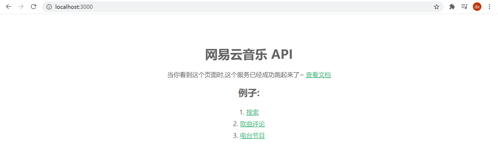
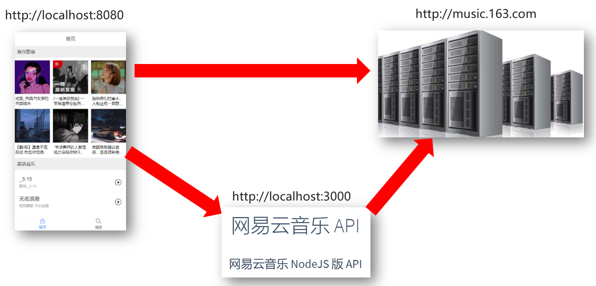
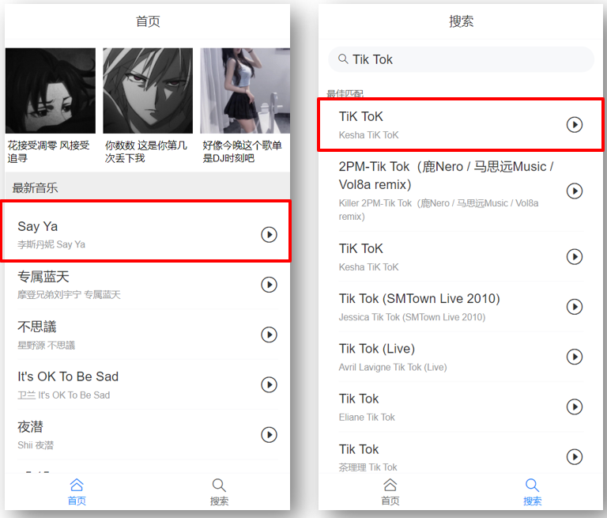

# Day08

## 知识点自测

- [ ] 知道reset.css和flexible.js的作用
- [ ] 什么是组件库-例如bootstrap作用
- [ ] yarn命令的使用
- [ ] 组件名字用name属性方式注册
- [ ] 如何自定义组件库样式

## 铺垫(自学)

> #### 本地接口项目部署

下载网易云音乐node接口项目, 在本地启动, 为我们vue项目提供数据支持

[项目地址](https://binaryify.github.io/NeteaseCloudMusicApi/#/?id=%e5%ae%89%e8%a3%85)

[备用地址](https://github.com/Binaryify/NeteaseCloudMusicApi/tree/master/docs)

下载后, 安装所有依赖, 在本地启动起来, 测试访问此地址是否有数据

http://localhost:3000, 看到如下页面就成功了 - 等着明天上课启动即可



> 总结: 前端请求本地的node项目, node服务器伪装请求去拿网易云音乐服务器数据转发回给自己前端

## 今日学习目标

1. 能够掌握vant组件库的使用
2. 能够掌握vant组件自定义样式能力
3. 能够掌握组件库使用和文档使用能力
4. 能够完成网易云音乐案例

## 1. 案例-网易云音乐

### 1.0 网易云音乐-本地接口

> 目的: 请求网易云音乐服务器API接口-获取数据



> 总结: 反向代理就是用本地开启cors的服务器去转发请求拿到数据

### 1.1 网易云音乐-本地接口启动

> 目的: 启动本地网易云音乐API服务

在今天的笔记铺垫中, 大家自学下载了一个项目启动即可

### 1.2 网易云音乐-前端项目初始化

> 目标: 初始化项目, 下载必备包, 引入初始文件, 配置按需自动引入vant, 创建页面组件

1. 初始化工程

   ```bash
   vue create music-demo
   ```

2. 下载需要的所有第三方依赖包

   ```bash
   yarn add axios vant vue-router 
   ```

4. 本次vant使用**自动按需引入**的方式

   文档: https://vant-contrib.gitee.io/vant/#/zh-CN/quickstart

   ```bash
   yarn add babel-plugin-import  -D
   ```
   
   在babel.config.js - 添加插件配置

   ```js
   plugins: [
       ['import', {
           libraryName: 'vant',
           libraryDirectory: 'es',
           style: true
       }, 'vant']
   ]
   ```


### 1.3 网易云音乐-需求分析

根据需求, 创建路由所需要的5个页面的组件

Layout(布局, 顶部导航和底部导航) > 二级路由 Home 和 Search

Play


### 1.4 layout路由

> 目标: 准备路由配置, 显示不同路由页面

创建Layout布局页面: views<Layout<index.vue

配置Layout路由

router/index.js - 准备路由 - 以及默认显示Layout, 然后Layout默认显示二级路由的首页

```js
// 路由-相关模块
import Vue from 'vue'
import VueRouter from 'vue-router'
import Layout from '@/views/Layout'

Vue.use(VueRouter)
const routes = [
    {
        path: '/',
        redirect: '/layout'
    },
    {
        path: '/layout',
        component: Layout,
    }
]

const router = new VueRouter({
    routes
})

export default router
```

main.js - 引入路由对象, 注册到new Vue中

```js
import router from '@/router'

new Vue({
  render: h => h(App),
  router
}).$mount('#app')
```

App.vue中留好router-view显示路由页面

```vue
<template>
  <div>
    <router-view></router-view>
  </div>
</template>
```

> 总结: 把项目的框搭好, 逐个攻破

### 1.5 layout-布局头部和底部

> 目标: 点击底部导航, 切换路由页面显示

文档: https://vant-contrib.gitee.io/vant/#/zh-CN/tabbar

1. 注册Tabbar组件, 在main.js中

   ```js
   import { Tabbar, TabbarItem, NavBar  } from 'vant';
   Vue.use(Tabbar)
   Vue.use(TabbarItem)
   Vue.use(NavBar)
   ```

2. 在Layout.vue中使用

   ```vue
   <template>
     <div class="layout">
       <van-nav-bar
         title="首页"
       />
         
       <van-tabbar v-model="active">
         <van-tabbar-item icon="home-o">首页</van-tabbar-item>
         <van-tabbar-item icon="search">搜索</van-tabbar-item>
       </van-tabbar>
     </div>
   </template>
   ```

### 1.6 layout-tabbar开启路由

1. 开启路由模式 route属性, 和to属性指向要切换的路由路径

   ```vue
   <van-tabbar route>
       <van-tabbar-item to="/layout/home" icon="home-o">首页</van-tabbar-item>
       <van-tabbar-item to="/layout/search" icon="search">搜索</van-tabbar-item>
   </van-tabbar>
   ```

2. 创建home和search页面

3. 配置路由规则

   ```js
   {
       path: '/layout',
       component: Layout,
       children: [
                   {
                       path: '/layout/home',
                       component: Home
                   },
                   {
                       path: '/layout/search',
                       component: Search
                   }
       ]
   }
   ```

4. layout路由占位

   ```jsx
   <template>
     <div class="layout">
       <van-nav-bar
         title="首页"
       />
       <router-view />
       <van-tabbar route>
         <van-tabbar-item to="/layout/home" icon="home-o">首页</van-tabbar-item>
         <van-tabbar-item to="/layout/search" icon="search">搜索</van-tabbar-item>
       </van-tabbar>
     </div>
   </template>
   ```

### 1.7 NavBar标题动态控制

1. 通过路由规则meta定义页面标题

   ```js
   {
       path: '/layout',
       component: Layout,
       children: [
         {
           path: '/layout/home',
           meta: {
             title: '首页'
           },
           component: Home
         },
         {
           path: '/layout/search',
           meta: {
             title: '搜索'
           },
           component: Search
         }
       ]
     }
   ```

2. 页面动态设置

   ```vue
   <van-nav-bar
         :title="$route.meta.title"
       />
   ```

   ```vue
   <template>
     <div class="layout">
       <van-nav-bar
         :title="title"
       />
     </div>
   </template>
   
   <script>
   export default {
     name: 'layout',
     data () {
       return {
         title: ''
       }
     },
   
     created () {
       this.title = this.$route.meta.title
     },
     watch: {
       $route (newVal, oldVal) {
         this.title = this.$route.meta.title
       }
     }
   }
   </script>
   
   ```

### 1.8 首页-推荐歌单布局

1. 结构

   ```vue
   	<!-- 推荐歌单 -->
       <van-cell class="title" title="推荐歌单" />
       <van-grid :border="false" :column-num="3">
         <van-grid-item>
           <van-image
           width="111"
           height="100"
           src=""
           />
           <p class="music-name van-multi-ellipsis--l2">
             12312312
           </p>
         </van-grid-item>
       </van-grid>
   ```

2. 样式

   ```css
   .home-container {
     .title {
       background-color: #c71d24;
       color: #fff;
     }
   
     .music-name {
       font-size: 12px;
       text-align: left;
       line-height: 20px;
       width: 100%;
       padding: 0 5px;
       box-sizing: border-box;
       height: 37px;
     }
   
     /deep/.van-grid-item__content {
       padding: 10px 0px;
     }
   }
   ```

### 1.9 首页-获取推荐歌单

**接口地址: /personalized**

先讲在页面发送请求,在过渡

1. 封装request

   ```js
   import axios from 'axios'
   // 基准地址进行抽离
   // axios.defaults.baseURL = 'http://localhost:3000'
   // axios.defaults.baseURL = 'http://liufusong.top:3009/'
   
   // axios.create 可以创建一个新的实例
   // 可以通过参数对象 进行自定义配置
   
   // 得到的request 具备axios同样的功能
   const request = axios.create({
     baseURL: 'http://localhost:3000'
   })
   
   // export const request2 = axios.create({
   //   baseURL: 'http://liufusong.top:3009/'
   // })
   
   export default request
   
   ```

   

1. 在api/music.js下定义推荐歌单的接口方法

   ```js
   // 首页 - 推荐歌单
   export const recommendMusic = params => request({
       url: '/personalized',
       params
       // 将来外面可能传入params的值 {limit: 20}
   })
   ```

4. 调用方法获取数据

   ```js
   import { getRecommendList } from '@/api/recommend.js'
   
   data () {
       return {
         recommendList: [] // 推荐歌单
       }
     },
   
   created () {
       this.getPersonalized()
     },
   
   methods: {
       // 获取推荐歌单
       async getPersonalized () {
         try {
           const res = await getRecommendList()
           this.recommendList = res.data.result
         } catch (err) {
           console.log('出错误了')
         }
       }
     }
   ```
   
3. 渲染数据

   ```vue
   <van-grid :border="false" :column-num="3">
       <van-grid-item v-for="item in recommendList" :key="item.id">
           <van-image
                      width="111"
                      height="100"
                      :src="item.picUrl"
                      />
           <p class="music-name van-multi-ellipsis--l2">
               {{ item.name }}
           </p>
       </van-grid-item>
   </van-grid>
   ```

### 1.11 首页-最新音乐

1. 实现基本结构

   ```vue
   <van-cell title="最佳匹配" />
   <van-cell label="12" title="1221">
       <template>
         <van-icon color="#000" name="play-circle-o" size="28" />
       </template>
     </van-cell>
   ```

2. 发送请求获取数据(接口定义在music.js)

   接口: **'/personalized/newsong'**

   

3. 渲染数据

### 1.11 搜索-布局

1. 准备搜索界面标签

```vue
<template>
  <div>
    <van-search
      shape="round"
      placeholder="请输入搜索关键词"
    />
    <!-- 热门搜索 -->
    <van-cell title="热门搜索" />
      <div style="padding: 10px 16px;">
        <van-tag color="red" size="large" plain round type="primary">
          123
        </van-tag>
      </div>
  </div>
</template>
<script>
export default {}
</script>
```

2. api/Search.js - 定义热门搜索接口方法和搜索结果方法

```js
import request from '@/utils/request'

// 搜索结果列表
export const searchResult = params => request({
    url: '/cloudsearch',
    params
})
```

3. created中请求接口-拿到热搜关键词列表

```js
created () {
    this.loadHotList()
  },
// 获取热门搜索数据
    async loadHotList () {
      try {
        const res = await getHotList()
        this.hots = res.data.result.hots
      } catch (err) {
        Toast('获取热门数据失败')
      }
    },
```

4. 数据渲染

```vue
<div style="padding: 10px 16px;">
    <van-tag v-for="item in hots" :key="item.first" color="red" size="large" plain round type="primary">
        {{ item.first }}
    </van-tag>
</div>
```

### 1.12 最佳匹配

1. 结构

   ```vue
   <van-cell title="最佳匹配" />
   
   <van-list
     v-model="loading"
     :finished="finished"
     finished-text="没有更多了"
     @load="onLoad"
   >
     <van-cell v-for="item in list" :key="item" :title="item" />
   </van-list>
   ```

2. 列表数据和方法

   ```js
   export default {
     data() {
       return {
         list: [],
         loading: false,
         finished: false,
       };
     },
     methods: {
       onLoad() {
         // 异步更新数据
         // setTimeout 仅做示例，真实场景中一般为 ajax 请求
         setTimeout(() => {
           for (let i = 0; i < 10; i++) {
             this.list.push(this.list.length + 1);
           }
   
           // 加载状态结束
           this.loading = false;
   
           // 数据全部加载完成
           if (this.list.length >= 40) {
             this.finished = true;
           }
         }, 1000);
       },
     },
   };
   ```

3. 分析....

### 1.13 根据输入框值获取搜索结果

1. search模块中定义获取搜索结果的接口

   ```js
   /**
    * 获取搜索结果
    * @param {Object} params { keywords, limit, offset }
    * @returns prosemi
    */
   export function getSearchList (params) {
     return request({
       url: '/cloudsearch',
       params
     })
   }
   ```

2. 在搜索页面中的onLoad中获取

   ```js
   // 加载搜索结果数据
       async onLoad () {
         // console.log('加载数据')
         // 加载数据
         // 1. 页面已进入: 在可视区域内显示了list列表
         // 2. onLoad加载后获取的数据展示到页面没有占满一屏
         // 3. 即将触底的时候加载数据
         // 1. 请求数据
         try {
           const res = await getSearchList({
             keywords: this.value,
             limit: this.limit,
             offset: 0
           })
           // res.data.result: songs(搜索结果列表) songCount: 总条数
           // 2. 保存数据
           console.log(res)
         } catch (err) {
           console.log(err)
         }
         // 3. 加载状态结束
       }
   ```

   

### 1.14 搜索结果-保存加载下一页

+ 保存数据和是否还有更多数据

  ```js
  try {
          const res = await getSearchList({
            keywords: this.value,
            limit: this.limit,
            offset: (this.page - 1) * this.limit
          })
          // res.data.result: songs(搜索结果列表) songCount: 总条数
          // 2. 保存数据
          // console.log(res)
          // 3. 加载状态结束
          this.loading = false
          if (res.data.result.songs) {
            this.list.push(...res.data.result.songs)
            this.count = res.data.result.songCount
            this.page++
          } else {
            // 4.数据全部加载完成的判断
            this.finished = true
          }
        } catch (err) {
          this.isError = true
          // this.loading = false
        }
  ```

  

### 1.15 到这里


> 目标: 如果只有一页数据/无数据判断

无数据/只有一页数据, finished为true

防止list组件触底再加载更多

还要测试-按钮点击/输入框有数据情况的加载更多

正确代码

```diff
 async fn(val) {
      // 点击热搜关键词
+        this.finished = false; // 点击新关键词-可能有新的数据
      this.value = val; // 选中的关键词显示到搜索框
      const res = await this.getListFn();
      console.log(res);
      this.resultList = res.data.result.songs;
+        this.loading = false; // 本次数据加载完毕-才能让list加载更多
    },
    async inputFn() {
+       this.finished = false // 输入框关键字改变-可能有新数据(不一定加载完成了)
      // 输入框值改变
      if (this.value.length === 0) {
        // 搜索关键词如果没有, 就把搜索结果清空阻止网络请求发送(提前return)
        this.resultList = [];
        return;
      }
      const res = await this.getListFn();
      console.log(res);
      
+      // 如果搜索结果响应数据没有songs字段-无数据
+      if (res.data.result.songs === undefined) {
+        this.resultList = [];
+        return;
+      }
      this.resultList = res.data.result.songs;
+        this.loading = false;
    },
    async onLoad() {
      // 触底事件(要加载下一页的数据咯), 内部会自动把loading改为true
      this.page++;
      const res = await this.getListFn();
+        if (res.data.result.songs === undefined) { // 没有更多数据了
+          this.finished = true; // 全部加载完成(list不会在触发onload方法)
+          this.loading = false; // 本次加载完成
+          return;
+        }
      this.resultList = [...this.resultList, ...res.data.result.songs];
+      this.loading = false; // 数据加载完毕-保证下一次还能触发onload
    },
```

> 总结: 在3个函数 上和下, 设置finished还未完成, 最后要把loading改成false, 判断songs字段, 对这里的值要非常熟悉才可以

### 1.16 网易云音乐-输入框-防抖

> 目标: 输入框触发频率过高

输入框输入"asdfghjkl"

​	接着快速的删除

​	每次改变-马上发送网络请求

​	网络请求异步耗时 – 数据回来后还是铺设到页面上

解决:

​	引入防抖功能

```js
async inputFn() {
    // 目标: 输入框改变-逻辑代码-慢点执行
    // 解决: 防抖
    // 概念: 计时n秒, 最后执行一次, 如果再次触发, 重新计时
    // 效果: 用户在n秒内不触发这个事件了, 才会开始执行逻辑代码
    if (this.timer) clearTimeout(this.timer);
    this.timer = setTimeout(async () => {
        this.finished = false; // 输入框关键字改变-可能有新数据(不一定加载完成了)
        // 输入框值改变
        if (this.value.length === 0) {
            // 搜索关键词如果没有, 就把搜索结果清空阻止网络请求发送(提前return)
            this.resultList = [];
            return;
        }
        const res = await this.getListFn();
        console.log(res);
        // 如果搜索结果响应数据没有songs字段-无数据
        if (res.data.result.songs === undefined) {
            this.resultList = [];
            return;
        }
        this.resultList = res.data.result.songs;
        this.loading = false;
    }, 900);
},
```

> 总结: 降低函数执行频率

### 1.17 网易云音乐-页码bug修复

> 目标: 第一个关键词page已经+到了10, 再第二个关键词应该从1开始

加载更多时, page已经往后计数了

重新获取时, page不是从第一页获取的

点击搜索/输入框搜索时, 把page改回1

代码如下:

```diff
 async fn(val) {
      // 点击热搜关键词
+      this.page = 1; // 点击重新获取第一页数据
      this.finished = false; // 点击新关键词-可能有新的数据
      this.value = val; // 选中的关键词显示到搜索框
      const res = await this.getListFn();
      console.log(res);
      this.resultList = res.data.result.songs;
      this.loading = false; // 本次数据加载完毕-才能让list加载更多
 },
 async inputFn() {
      // 目标: 输入框改变-逻辑代码-慢点执行
      // 解决: 防抖
      // 概念: 计时n秒, 最后执行一次, 如果再次触发, 重新计时
      // 效果: 用户在n秒内不触发这个事件了, 才会开始执行逻辑代码
      if (this.timer) clearTimeout(this.timer);
      this.timer = setTimeout(async () => {
+        this.page = 1; // 点击重新获取第一页数据
        this.finished = false; // 输入框关键字改变-可能有新数据(不一定加载完成了)
        // 输入框值改变
        if (this.value.length === 0) {
          // 搜索关键词如果没有, 就把搜索结果清空阻止网络请求发送(提前return)
          this.resultList = [];
          return;
        }
        const res = await this.getListFn();
        console.log(res);
        // 如果搜索结果响应数据没有songs字段-无数据
        if (res.data.result.songs === undefined) {
          this.resultList = [];
          return;
        }
        this.resultList = res.data.result.songs;
        this.loading = false;
      }, 900);
 },
```

> 总结: 切换时, 让page页面回到1

### 1.18 网易云音乐-Layout边距优化

> 目标: 上下导航会盖住中间内容

我们的头部导航和底部导航挡住了中间内容

给中间路由页面设置上下内边距即可

在Layout/index.vue中

```css
/* 中间内容区域 - 容器样式(留好上下导航所占位置) */
.main {
  padding-top: 46px;
  padding-bottom: 50px;
}
```

### 1.19 网易云音乐-SongItem封装

> 目标: 把首页和搜索结果的歌曲cell封装起来



创建src/components/SongItem.vue

```vue
<template>
  <van-cell center :title="name" :label="author + ' - ' + name">
    <template #right-icon>
      <van-icon name="play-circle-o" size="0.6rem"/>
    </template>
  </van-cell>
</template>

<script>
export default {
  props: {
    name: String, // 歌名
    author: String, // 歌手
    id: Number, // 歌曲id (标记这首歌曲-为将来跳转播放页做准备)
  }
};
</script>

<style scoped>
/* 给单元格设置底部边框 */
.van-cell {
  border-bottom: 1px solid lightgray;
}
</style>
```

Home/index.vue - 重构

==注意: author字段不同==

```vue
<SongItem v-for="obj in songList"
    :key="obj.id"
    :name="obj.name"
    :author="obj.song.artists[0].name"
    :id="obj.id"
></SongItem>
```

Search/index.vue - 重构

==注意: author字段不同==

```vue
<SongItem
          v-for="obj in resultList"
          :key="obj.id"
          :name="obj.name"
          :author="obj.ar[0].name"
          :id="obj.id"
></SongItem>
```

> 总结: 遇到重复标签要封装

### 1.20 网易云音乐-播放音乐

> 目标: 从预习资料拿到播放的api和页面, 配置好路由规则

==时间关系,这个页面不用写, 直接用, 注释在备课代码里写好了==

组件SongItem里 – 点击事件

api/Play.js – 提前准备好 – 接口方法

跳转到Play页面 – 把歌曲id带过进去

在SongItem.vue - 点击播放字体图标

```js
methods: {
    playFn(){
        this.$router.push({
            path: '/play',
            query: {
                id: this.id // 歌曲id, 通过路由跳转传递过去
            }
        })
    }
}
```


> 总结: 准备好播放页, 点击播放传歌曲id过去, 到播放页-再请求响应数据和歌曲地址用audio标签播放

### 1.21 网易云音乐-vant适配

> 目标: 切换不同机型, ==刷新后==看看标签大小适配吗

* postcss – 配合webpack翻译css代码
* postcss-pxtorem – 配合webpack, 自动把px转成rem
* 新建postcss.config.js – 设置相关配置
* 重启服务器, 再次观察Vant组件是否适配

1. 下载postcss和==postcss-pxtorem@5.1.1==

   postcss作用: 是对css代码做降级处理

   postcss-pxtorem: 自动把所有代码里的css样式的px, 自动转rem

2. src/新建postcss.config.js

```js
module.exports = {
  plugins: {
    'postcss-pxtorem': {
      // 能够把所有元素的px单位转成Rem
      // rootValue: 转换px的基准值。
      // 例如一个元素宽是75px，则换成rem之后就是2rem。
      rootValue: 37.5,
      propList: ['*']
    }
  }
}
```

==以iphone6为基准, 37.5px为基准值换算rem==

## 今日总结

- [ ] 掌握vant组件库的使用 - 找组件, 引组件, 用组件
- [ ] 能够对vant组件自带样式进行覆盖自定义
- [ ] 遇到重复的标签, 自己也封装了一个复用的组件
- [ ] 掌握查询文档和使用每个属性的方式

## 今日作业

把课上的案例-从0再来一遍, 为下阶段移动端项目铺垫